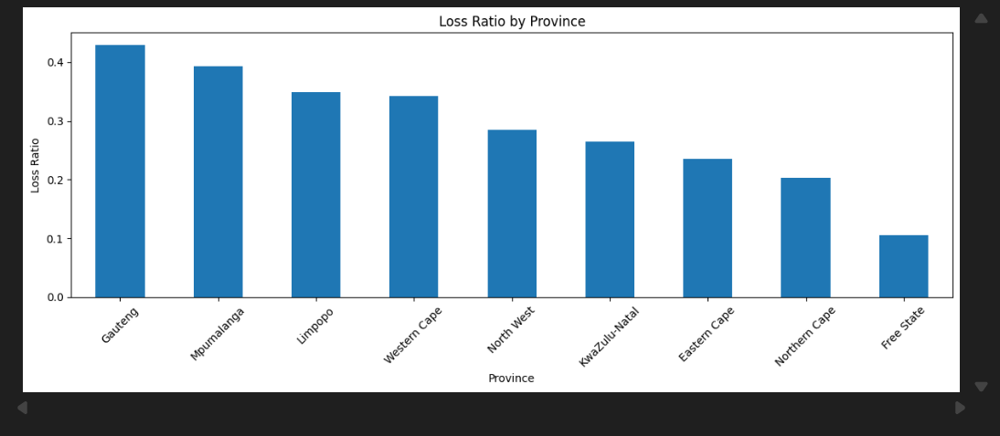
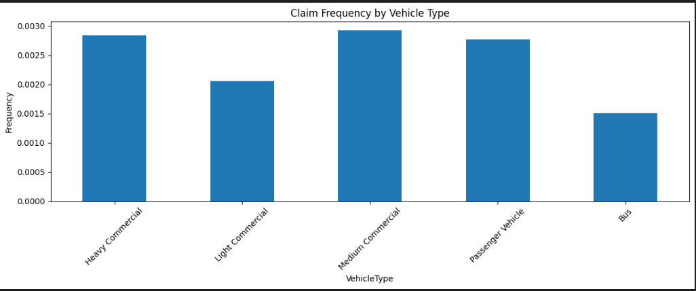
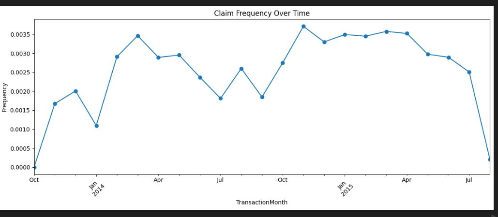
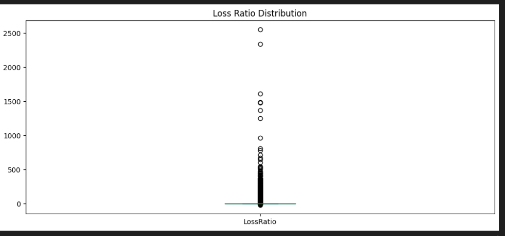

# Interim Report — Insurance Risk Analytics Project

**Student:** Yordanos Moges  
**Course:** Applied Machine Learning  
**Date:** 11/8/2025  

---

## 1️⃣ Project Overview

This project analyzes insurance policy data to understand customer risk levels and claim behavior. The work includes data exploration, cleaning, visualization (Task-1), and proper dataset version control using DVC (Task-2).

Dataset includes:
- Customer demographics
- Vehicle details (make, model, year, engine)
- Policy and claim information

Goal: Build a predictive model for insurance risk in future tasks.

---

## 2️⃣ Task-1: Exploratory Data Analysis (EDA)

Work Completed:
- Imported dataset from `.txt` (pipe-separated)
- Cleaned missing / invalid values
- Converted `TransactionMonth` into datetime format
- Created feature: **HasClaim** (1 = claim, 0 = no claim)

Main Insights:
- Most customers do **not** file any claims
- Monthly claim frequency shows seasonal behavior
- Some customers display **very high loss ratios** → high risk

### Included Visualizations:
### Visualizations

#### Loss Ratio by Province

#### Claim Frequency by Vehicle Type

#### Claim Frequency Over Time

#### Loss Ratio Distribution

File completed:  
📍 `notebooks/task1_eda.ipynb`  
Committed + Merged → `main` branch ✔️

---

## 3️⃣ Task-2: Data Version Control (DVC)

To solve GitHub large-file restriction, DVC was used to track dataset instead of Git.

💻 Commands executed:

python -m dvc init
python -m dvc add data/MachineLearningRating_v3/MachineLearningRating_v3.txt
python -m dvc remote add -d localstorage ./storage
python -m dvc push
git filter-branch --force --index-filter "git rm --cached --ignore-unmatch data/MachineLearningRating_v3/MachineLearningRating_v3.txt" --prune-empty --tag-name-filter cat -- --all
git push --set-upstream origin main --force

DVC successfully:
✔ Tracks dataset versions  
✔ Stores dataset outside GitHub  
✔ Prevented file-size error  
✔ Keeps repo clean & lightweight  

### DVC Evidence (include screenshots):
- Terminal showing `python -m dvc add`
- Terminal showing `python -m dvc push`
- Terminal showing `python -m dvc status` → **up to date**
- GitHub repo showing dataset is NOT included

---

## 4️⃣ GitHub Repository Link

🔗 https://github.com/yordanosmoges2/acis-insurance-analytics

Repository includes:
- README.md
- Jupyter Notebook (Task-1)
- DVC metadata files
- Report file
- Clean Git commit history

---

## 5️⃣ Next Steps

Task-3 (coming next):
- Feature selection & engineering
- ML models: Logistic Regression, Random Forest, Gradient Boosting
- Performance evaluation using AUC-ROC & accuracy
- Deployment: risk prediction pipeline

---

## 6️⃣ Conclusion

Task-1 and Task-2 Completed Successfully 🎯

| Completed | Description |
|----------|-------------|
| ✔️ | EDA + Visual insights |
| ✔️ | DVC setup and data tracking |
| ✔️ | Pushed full project to GitHub |
| ✔️ | Report ready for submission |

The project is fully prepared to move into machine learning model development.

